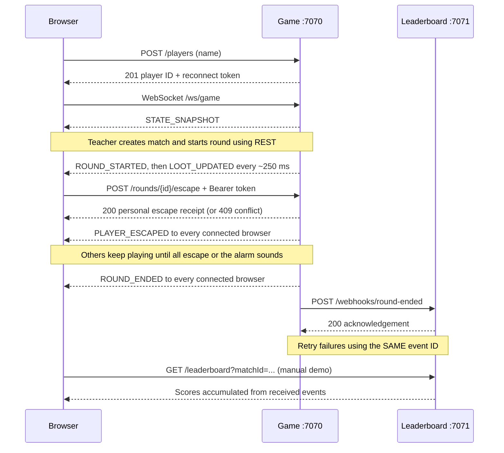

# Bank Heist

A small Java classroom game for teaching **REST, WebSockets, webhooks, and REST Assured**. Players fill their own bags with gold and decide when to escape. Each player banks their own bag when they escape. The round continues until everyone escapes or the hidden alarm catches those still inside.

Two independently runnable Javalin apps, one plain HTML/JavaScript UI, and in-memory state. Java 17+, Maven 3.9+, no database or frontend build required. Dependencies are pinned in `pom.xml`.

## Run it before class

```sh
mvn clean verify
```

In terminal 1:

```sh
java -cp target/bank-heist-1.0-SNAPSHOT.jar dk.bankheist.LeaderboardServer
```

In terminal 2:

```sh
java -cp target/bank-heist-1.0-SNAPSHOT.jar dk.bankheist.GameServer
```

Open **http://localhost:7070**. Join in at least two independently opened tabs. Expand **Teacher controls**, enter `classroom`, click **Create match**, then **Start next round**. There is a three-second countdown. Each match has ten rounds; the teacher starts every round manually. The tenth result announces the winner(s).

Each tab stores its player ID and token in `sessionStorage`: reloads reconnect as the same player. Open a fresh tab by typing the URL; duplicating a tab can copy its session and therefore its identity. Different browsers or private windows are another convenient way to get separate players.

For a classroom LAN, students use `http://TEACHER-LAN-IP:7070`; allow inbound TCP 7070 in the host firewall. Students don't need Java. The game server calls the leaderboard locally, so students don't need access to 7071. This is a trusted classroom demo, not a public deployment.

To start the first lesson **without the alarm**, use this instead of the terminal 2 command:

```sh
# Bash / Git Bash / macOS / Linux
ALARM_ENABLED=false java -cp target/bank-heist-1.0-SNAPSHOT.jar dk.bankheist.GameServer
```

```powershell
# PowerShell
$env:ALARM_ENABLED = 'false'
java -cp target/bank-heist-1.0-SNAPSHOT.jar dk.bankheist.GameServer
```

Stop the game with Ctrl+C and restart with `ALARM_ENABLED=true` for the alarm lesson. Restarting loses game state; rejoin afterwards. PowerShell environment settings persist in that terminal until changed or removed.

For development, the alternatives are `mvn exec:java -Dexec.mainClass=dk.bankheist.GameServer` and `mvn exec:java -Dexec.mainClass=dk.bankheist.LeaderboardServer` in separate terminals.

## What students are building



| Mechanism | Who initiates? | Connection / lifetime | Used here for |
| --- | --- | --- | --- |
| REST | Browser or API client | Individual HTTP requests and responses | Join, teacher actions, escape, read state |
| WebSocket | Browser opens the connection | Persistent, supports messages both ways | Server pushes snapshots and live updates |
| Webhook | Game server after an event | An ordinary outbound HTTP request per delivery attempt | Notify a separate service that a round ended |

A webhook is an application convention built on HTTP. A WebSocket is a protocol supporting ongoing two-way communication. This version intentionally sends player actions through REST and uses the WebSocket for server updates; students can add WebSocket actions later.

The game credits gold immediately on each escape. The leaderboard receives one event only when the whole round ends, so it intentionally lags during an active round. It is an **eventually consistent copy**: it can lag behind when delivery fails. Receiving a webhook doesn't require the leaderboard to connect to, poll, or subscribe over a socket to the game.

## Rules worth explaining

- 2–8 registered players, one shared match, ten rounds.
- Each personal bag starts at zero and grows at 10 gold/second, measured by the server. The rate is independent of crew size.
- Each round's alarm duration is chosen uniformly from 5–25 seconds after the countdown. It is never included in public messages.
- Each player banks their entire bag: `elapsed seconds at escape × 10`. There is no shared pool, division, fee, or first-escape bonus.
- With any crew size: escaping at 10 seconds banks 100 gold; escaping at 20 seconds banks 200 gold. An early escape does not affect anyone else's payout.
- An immediate escape banks zero. If the alarm sounds, only players still inside earn zero; previously banked gold stays safe.
- The round ends when everybody has escaped (`ALL_ESCAPED`) or the alarm sounds (`ALARM`). The latter can include both escaped and caught players.
- The participant list freezes when the match is created. Later arrivals wait until the next match. A disconnected player still inside can be caught; disconnecting never pauses play or banks gold.
- Scores use unrounded Java `double` values internally. The UI displays two decimals; this is not decimal accounting software.
- Highest cumulative score wins; exact ties share the win.

**Alarm disabled:** every participant must escape before the next round can start. Reconnect any missing player, or restart the game to reset a stuck classroom demonstration.

The eight registrations persist until the game server restarts, including closed tabs. There is no remove-player endpoint. Restart between classroom groups to clear slots; creating another match resets scores and includes all registered players.

## A 90-minute teaching sequence

| Time | Demonstration | Ask the class |
| --- | --- | --- |
| 0–15 min | Alarm off; join and play via REST | What makes a request valid? Which status code describes a second escape? |
| 15–30 min | Open two browsers and inspect WebSocket frames | Why is polling unnecessary? Is the WebSocket required to send actions? |
| 30–45 min | Enable alarm; simultaneous escapes | Whose clock decides? What if the timer callback runs late? |
| 45–60 min | Inspect result webhooks and leaderboard | Which application initiates this request? Is the leaderboard authoritative? |
| 60–75 min | Stop receiver, retry, send duplicates | Does a timeout prove that the receiver did nothing? |
| 75–90 min | Read and extend REST Assured tests | Which assertions verify behavior rather than just a 200 response? |

### 1. REST baseline

Use the UI first, then repeat using DevTools Network, curl, or your preferred HTTP client. The commands below use Bash syntax and `curl`; use Git Bash on Windows for direct copy/paste. No `jq` dependency is required: copy IDs and tokens from each response.

```sh
curl -i http://localhost:7070/players \
  -H 'Content-Type: application/json' -d '{"name":"Alice"}'
curl -i http://localhost:7070/players \
  -H 'Content-Type: application/json' -d '{"name":"Bob"}'
```

Each returns **201**, `playerId`, and `reconnectToken`. Copy Alice's token:

```sh
TOKEN='paste-alice-reconnectToken'
curl -i http://localhost:7070/players/me -H "Authorization: Bearer $TOKEN"
curl -i -X POST http://localhost:7070/matches -H 'X-Teacher-Key: classroom'
MATCH='paste-matchId'
curl -i -X POST "http://localhost:7070/matches/$MATCH/rounds" \
  -H 'X-Teacher-Key: classroom'
ROUND='paste-roundId'
# Wait for the three-second countdown, then:
curl -i -X POST "http://localhost:7070/rounds/$ROUND/escape" \
  -H "Authorization: Bearer $TOKEN"
curl -s http://localhost:7070/state
# Alice is out; Bob is still inside. Use Bob's token to finish this alarm-free round:
BOB_TOKEN='paste-bob-reconnectToken'
curl -i -X POST "http://localhost:7070/rounds/$ROUND/escape" \
  -H "Authorization: Bearer $BOB_TOKEN"
```

Discuss the difference between an identifier and a credential: `roundId` targets an action; the bearer token identifies its player. A successful Escape returns `{matchId, roundId, playerId, outcome:"ESCAPED", earnings}`. Repeating Escape for that same player returns **409**, not another payout. Other players can still escape successfully. Omitting the token returns **401**. During the countdown, Escape returns **409**. A late-arriving registered spectator cannot escape either.

Creating a match returns `READY`; it does not start a round. This leaves time to inspect responses before the countdown.

### 2. WebSockets: observe, reconnect, compare

Open DevTools → Network → WS → `/ws/game` → Messages. The connection starts with `STATE_SNAPSHOT`; later messages include `ROUND_STARTED`, `LOOT_UPDATED`, `PLAYER_ESCAPED`, and `ROUND_ENDED`.

Every envelope contains `type`, `matchId`, `roundId`, `revision`, and `state`. The state includes phase, elapsed time, current personal `bagValue`, public players and scores, last round result, and winner IDs. Each player also has `roundStatus` (`WAITING`, `INSIDE`, `ESCAPED`, `CAUGHT`, or `SPECTATING`), `roundEarnings`, and `escapePayout`. The browser renders your own status and disables Escape once you are out; other players keep their buttons enabled. It excludes tokens and the alarm deadline.

For a minimal independent client, paste this in the browser console on the game page:

```js
const demoSocket = new WebSocket(`ws://${location.host}/ws/game`);
demoSocket.onmessage = event => console.log(JSON.parse(event.data));
// Later: demoSocket.close();
```

Start a round and let one player escape. Their browser shows **Safely banked this round** while the other browser still offers Escape. Reload the escaped player’s tab: the fresh snapshot restores their identity, banked amount, and disabled button even though the round is still active. If a player disconnects while inside, the alarm can still catch them.

Explain the increasing revision: the browser ignores messages older than the state it already rendered. A new connection accepts its first snapshot even if the server restarted and revisions reset. Updates contain complete snapshots rather than patches, so clients don't have to reconstruct missing events.

The browser displays your server-calculated bag or safely banked amount. Caught players see their lost bag and zero banked. After escaping, a smaller live comparison shows what those still inside can bank. When everyone escapes, it compares your earnings with the largest bag actually banked; it does not claim that was the latest safe escape time. After an alarm, it confirms your gold is safe and those who stayed were caught. It does not independently calculate scores or decide who won a race.

### 3. Race conditions and deadlines

Have two different students press Escape together: both can succeed. Then send concurrent requests with the **same token**: only one can bank gold; the duplicate returns **409**. Every browser sees the same crew statuses, while personal panels differ.

Read `Game.escape`, `advance`, and `close` together. The unsafe pattern is:

```java
// Discussion example only — do not use this implementation!
if (roundIsActive() && playerIsInside()) {
    // Another request with the same token could pass this check too.
    bankPlayerGold();
}
```

In the implementation, validation, deadline checking, personal escape, closure, and score updates use the same `synchronized` monitor. The timer enters through `tick` and uses that monitor too. A request handled at or after the deadline closes as `ALARM`, even when the scheduled callback hasn't run. Escaped players keep their money; only remaining players become `CAUGHT`. The server's clock decides whether an escape beat the alarm, not the browser's click timestamp. A last escape and the timer can produce only one round-ending event.

`System.nanoTime()` measures durations; `Instant.now()` supplies the webhook's human-readable timestamp. These have different purposes: a wall-clock adjustment must not extend a round.

The lock only covers in-memory work. It produces immutable snapshots/results and places messages on a queue. Separate threads broadcast messages and deliver HTTP webhooks. A slow receiver cannot hold the game lock.

Run the focused examples:

```sh
mvn -Dtest=GameTest test
```

`alarmWinsExactlyAtDeadlineEvenWithoutTimerCallback` uses an injected clock. `simultaneousDistinctEscapesBothSucceedAndCloseExactlyOnce` releases two different players together. `simultaneousDuplicateEscapesCreditExactlyOnce` checks that concurrent clicks by one player cannot double-credit gold. There are no multi-second round sleeps in these tests.

### 4. Webhooks and idempotency

With the leaderboard running, close a round and click **Inspect webhooks** in the teacher panel. Notice the stable event ID, attempt count, and status. The event body contains:

```json
{
  "eventId": "demo-event-1",
  "matchId": "demo-match",
  "roundId": "demo-round-1",
  "outcome": "ALL_ESCAPED",
  "bagValue": 200.0,
  "endedAt": "2026-09-30T12:00:00Z",
  "earnings": [
    {"playerId": "alice", "earnings": 100.0, "status": "ESCAPED"},
    {"playerId": "bob", "earnings": 200.0, "status": "ESCAPED"}
  ]
}
```

This is a two-player example: Alice escaped at 10 seconds and banked 100; Bob escaped at 20 seconds and banked 200. The top-level `bagValue` records what a single bag held at round closure (also the amount lost by each caught player), not a shared pool or the sum actually banked. For `ALARM`, escaped entries retain their earnings; entries with `status:"CAUGHT"` have zero earnings. There is no single `escapedBy` field anymore.

Send the supplied fixture twice:

```sh
curl -i http://localhost:7071/webhooks/round-ended \
  -H 'Content-Type: application/json' --data-binary @examples/round-ended.json
# Run the exact same command again.
curl -s 'http://localhost:7071/leaderboard?matchId=demo-match'
```

First response: `{"accepted":true,"duplicate":false}`. Second response: `{"accepted":true,"duplicate":true}` (JSON field order may differ). Both are **200**. Scores stay Alice 100 / Bob 200; `roundsReceived` stays 1.

The receiver atomically checks the event ID and updates scores. A reused event ID with a changed body returns **409**. A second event ID for an already recorded round also returns **409**. IDs are scoped to the running receiver's in-memory store.

A success acknowledgement means the sender may stop retrying. If the receiver saves an event but its response is lost, the sender must retry; the receiver therefore needs idempotency. This provides an exactly-once **score effect while the receiver retains its state**, not exactly-once network delivery.

### 5. Failure exercise

1. Stop the leaderboard with Ctrl+C; keep the game running.
2. Complete another round. Gameplay and the authoritative scores continue.
3. Inspect delivery state:

   ```sh
   curl -s http://localhost:7070/webhook-deliveries -H 'X-Teacher-Key: classroom'
   ```

4. Restart the leaderboard. Pending deliveries retry automatically. Each HTTP request has a two-second timeout. The worker makes at most eight attempts, with retry delays of 1, 2, 4, 8, 16, 30, and 30 seconds. A queue of events or connection timeouts can extend the elapsed time.
5. If the event is already `FAILED`, copy its ID and manually retry:

   ```sh
   EVENT='paste-eventId'
   curl -i -X POST "http://localhost:7070/webhook-deliveries/$EVENT/retry" \
     -H 'X-Teacher-Key: classroom'
   ```

6. Read the board with the real match ID:

   ```sh
   curl -s "http://localhost:7071/leaderboard?matchId=$MATCH"
   ```

7. Retry that delivered event again. It reuses the same payload and ID; the receiver acknowledges a duplicate and the scores remain unchanged.

**Restart detail:** the leaderboard also uses memory, so restarting it loses previously received scores and deduplication IDs. Only still-pending events arrive automatically. To rebuild its full current board, replay *all* events for that match using the game's delivery history. Restarting the game loses that history too. This limitation is intentional and a useful lead-in to durable outboxes and databases.

### 6. REST Assured refresher

Start with `src/test/java/dk/bankheist/ApiTest.java`. Tests start actual Javalin servers on port `0` (OS-assigned free ports), send HTTP requests, then stop their servers. They do not require the manually running apps and don't share global REST Assured port settings.

The basic structure is arrange/request/assert:

```java
import static io.restassured.RestAssured.given;
import static org.hamcrest.Matchers.equalTo;

// Within a test with a running server, an active round, and valid credentials:
given()
    .port(server.port())
    .header("Authorization", "Bearer " + alice.reconnectToken())
.when()
    .post("/rounds/" + round.roundId() + "/escape")
.then()
    .statusCode(200)
    .body("outcome", equalTo("ESCAPED"))
    .body("playerId", equalTo(alice.playerId()));
```

Topics to revisit:

- **Setup:** send JSON with `.contentType("application/json").body(...)`.
- **Extraction:** `.extract().path("matchId")` lets the next request use a server-generated ID. `.extract().as(Credentials.class)` maps JSON to a record.
- **Assertions:** check status, response fields, and observable state after the request. A 200 alone doesn't prove correct scores.
- **Negative paths:** missing credentials (401), invalid JSON/name (400), stale round or repeated escape (409).
- **Numbers:** REST Assured's default JSON number mapping commonly uses `float` for decimals; examples use `equalTo(200f)`. Use tolerances for fractional payouts.
- **Isolation:** each test gets new game and leaderboard state; no ordering dependency.
- **Asynchronous effects:** poll a condition with a deadline instead of assuming the webhook arrived when Escape returned. The test helper waits at most five seconds.

Run subsets:

```sh
mvn -Dtest=ApiTest test
mvn -Dtest=WebhookDeliveryTest test
mvn -Dtest=ApiTest#duplicateWebhooksAreAcknowledgedButNotAddedTwice test
```

REST Assured handles the HTTP assertions. The WebSocket test uses Java's `HttpClient` WebSocket API; it assembles frames, checks message types, and reconnects for a snapshot. `WebhookDeliveryTest` deliberately accepts an event and then responds 503 once, demonstrating why retries must preserve the event ID.

Student exercises, in increasing difficulty:

1. Add a REST Assured test for an empty player name and one for the ninth registration.
2. Add an HTTP test where a late joiner attempts Escape. Assert 409 and unchanged round state.
3. Start round two, resend round one's Escape, and assert that round two stays active.
4. Post an alarm fixture with one escaped player and one caught player twice. Assert that the escaped earnings are preserved, the caught earnings are zero, and only one round is recorded.
5. Extend the UI to show webhook delivery status without pressing Refresh. Decide whether to poll or introduce another stream, and justify the choice.
6. Add an `ESCAPE` WebSocket message with `roundId` and the player's token. Reuse `Game.escape` rather than duplicating scoring/locking. Return a request-specific success/error message; retain server-side deadline checks. Never broadcast the token.
7. Replace in-memory delivery history and deduplication with persistent storage. Explain what must be atomic on both sides.

## API reference

| Port | Method/path | Authentication | Success / behavior |
| --- | --- | --- | --- |
| 7070 | `POST /players` | None | 201 `{playerId,reconnectToken}`; body `{name}` |
| 7070 | `GET /players/me` | Bearer reconnect token | 200 public identity and participation |
| 7070 | `GET /state` | None | 200 current snapshot |
| 7070 | `POST /matches` | `X-Teacher-Key` | 201 match in READY state |
| 7070 | `POST /matches/{matchId}/rounds` | `X-Teacher-Key` | 201 round in COUNTDOWN state |
| 7070 | `POST /rounds/{roundId}/escape` | Bearer reconnect token | 200 personal escape receipt; round can continue |
| 7070 | `WS /ws/game` | None | Spectator-safe snapshots and updates |
| 7070 | `GET /webhook-deliveries` | `X-Teacher-Key` | 200 history, payloads, attempts, errors |
| 7070 | `POST /webhook-deliveries/{eventId}/retry` | `X-Teacher-Key` | 202; requeue failed/delivered event, pending is a no-op; unknown ID 404 |
| 7071 | `POST /webhooks/round-ended` | None (trusted demo) | 200 acknowledgement, including duplicates |
| 7071 | `GET /leaderboard?matchId=...` | None | 200 scores sorted descending; unknown match has empty scores |
| Both | `GET /health` | None | 200 `{status:"ok"}` |

There is no CORS setup needed: the UI talks to the game on its own origin; the webhook is server-to-server. Read the leaderboard in its own browser tab, through curl, or with REST Assured. Cross-origin browser `fetch` calls are a separate CORS lesson.

| Environment variable | Default | Application |
| --- | --- | --- |
| `GAME_PORT` | `7070` | Game |
| `LEADERBOARD_PORT` | `7071` | Leaderboard |
| `ALARM_ENABLED` | `true` | Game; use `false` for the first lesson |
| `TEACHER_KEY` | `classroom` | Game; enter the same value in the UI |
| `WEBHOOK_URL` | `http://localhost:7071/webhooks/round-ended` | Game; change when receiver is elsewhere |

Changing `LEADERBOARD_PORT` does not automatically change the game's `WEBHOOK_URL`. Keep these settings consistent.

## Code map and boundaries

| File | Responsibility |
| --- | --- |
| `Game.java` | Locked game state machine, monotonic time, payout rules, immutable event queue |
| `Protocol.java` | JSON records shared by the two applications |
| `GameServer.java` | REST routes, teacher/player authentication, timer, WebSocket broadcasts |
| `WebhookDelivery.java` | HTTP delivery worker, bounded retry attempts, inspection/replay history |
| `LeaderboardServer.java` | Validated webhook receiver, atomic deduplication and score accumulation |
| `src/main/resources/public/` | Browser UI, session identity, reconnect and revision handling |
| `GameTest.java` | Individual banking, mixed alarm outcomes, deadlines, concurrent and duplicate escapes, match lifecycle |
| `ApiTest.java` | REST Assured HTTP flows, webhook idempotency, real WebSocket/reconnect checks |
| `WebhookDeliveryTest.java` | Lost acknowledgement and bounded retry/recovery checks |

State transitions: `LOBBY → READY → COUNTDOWN → ACTIVE → RESULTS`, then another countdown. Round ten closes into `FINISHED`; creating a new match returns to `READY`.

This version deliberately omits accounts, a database, signatures, durable delivery, multiple rooms, and public hosting controls. Anyone with the classroom teacher key can operate the controls. The webhook receiver trusts its callers. Event history and queues live in memory and aren't size-limited; retry *attempts* are bounded. A production system would need persistence, resource limits, authentication, and backpressure appropriate to its deployment.

If a port is occupied, stop the previous app or change the port settings. If Maven reports a missing compiler, check `java -version`, `mvn -version`, and `JAVA_HOME`: use a JDK, not just a JRE. If the UI reconnects after a game restart, old credentials are cleared automatically because the in-memory registrations no longer exist.

References for further reading: [Javalin documentation](https://javalin.io/documentation) (the project pins Javalin 6; current docs can describe a newer major), [REST Assured usage guide](https://github.com/rest-assured/rest-assured/wiki/Usage), and the original [bank heist design](bank-heist-design.md).
